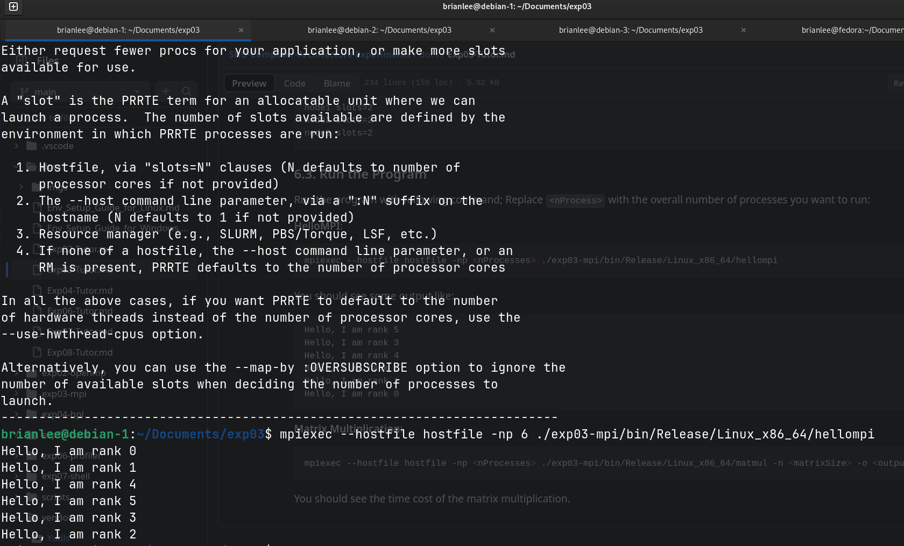

# Outcome
```shell
brianlee@debian-1:~/Documents/exp03$ mpiexec --hostfile hostfile -np 6 ./exp03-mpi/bin/Release/Linux_x86_64/hellompi
Hello, I am rank 0
Hello, I am rank 1
Hello, I am rank 4
Hello, I am rank 5
Hello, I am rank 3
Hello, I am rank 2
```


# Use gnome boxes
1. as normal, do what UI says
2. connect by bridge
> boxes use NAT as default
[refer](https://blog.agchapman.com/configuring-gnome-boxes-vms-using-virt-manager/)
```powershell
dnf install virt-manager
```
Then, see the reference set forth

# Clone VM and ssh through hostname
CHECK if port22 is open using `sudo ss -tulpn | grep :22` first, or `sudo service sshd start`
> To form a group
1. clone the VM in UI
2. change the hostname
> To make the hostname different, therefore can `ssh` more directly
```powershell
hostname # check the original hostname
sudo hostnamectl set-hostname [new_name]
cd /etc/hosts
# convert [original] to [new_name]
```
> if you wanna change username
```powershell
su -
usermod -l [new_name] [old_name]
```
3. add DNS resolution
```powershell
cd /etc/hosts
[ip] [hostname] # e.g. 192.168.1.101 debian-1
```
4. Then you can `ssh [hostname]` to connect to `[username]@[hostname]`
5. [More] About firewall
   > mostly use firewalld or iptable
   >> command about `firewalld` [refer](https://www.jianshu.com/p/e0fdecfcee4b)

# Extend the volume
Problem discription: when `df`, get 
```powershell
Filesystem                  1K-blocks    Used Available Use% Mounted on
/dev/mapper/debian--vg-root   6930164 6635140         0 100% /
```
0. Some concepts: [refer](https://www.cnblogs.com/stragon/p/5806388.html)
1. gnome boxes add up the `storage limit`
2. check the block devices(storage devices like HDD included) with `lsblk`, then you can find out that there are something not in use
3. 将新分配的存储空间创建物理卷, [refer](https://blog.csdn.net/weixin_49042937/article/details/116231803)中第一部分，then you can check through `lsblk`
4. 利用vgextend命令将新的物理卷（/dev/[new_name]）加入到卷组中, [refer](https://www.cnblogs.com/stragon/p/5806388.html) in the ending part
5. Resize the filesystem: `resize2fs /dev/DebianVG/home`

# Dir
1. cmake [knowledge](https://cloud.tencent.com/developer/article/1635620)
2. `scp` command [details](https://www.xiexianbin.cn/linux/ssh/scp/index.html)
3. solve auto sleep of remote server, [refer](https://blog.csdn.net/bandaoyu/article/details/116999236)

# BUGS to solve
1. When linking, the `matmul` break the rule of PIE
   ```
   brianlee@debian-1:~/Documents/exp03$ CC=mpicc CXX=mpicxx bash scripts/build-exp03.sh
   make: *** No rule to make target 'clean'.  Stop.
   -- The C compiler identification is GNU 12.2.0
   -- The CXX compiler identification is GNU 12.2.0
   -- Detecting C compiler ABI info
   -- Detecting C compiler ABI info - done
   -- Check for working C compiler: /usr/local/openmpi-5.0.3/bin/mpicc - skipped
   -- Detecting C compile features
   -- Detecting C compile features - done
   -- Detecting CXX compiler ABI info
   -- Detecting CXX compiler ABI info - done
   -- Check for working CXX compiler: /usr/local/openmpi-5.0.3/bin/mpicxx - skipped
   -- Detecting CXX compile features
   -- Detecting CXX compile features - done
   -- Found MPI_C: /usr/local/openmpi-5.0.3/bin/mpicc (found version "3.1") 
   -- Found MPI_CXX: /usr/local/openmpi-5.0.3/bin/mpicxx (found version "3.1") 
   -- Found MPI: TRUE (found version "3.1")  
   -- MPI Found
   -- Configuring done
   -- Generating done
   -- Build files have been written to: /home/brianlee/Documents/exp03/exp03-mpi/build
   [ 50%] Building CXX object CMakeFiles/matmul.dir/src/matmul_main.cpp.o
   [100%] Linking CXX executable /home/brianlee/Documents/exp03/exp03-mpi/bin/Release/Linux_x86_64/matmul
   /usr/bin/ld: /home/brianlee/Documents/exp03/exp03-mpi/../vendor/Yutils/lib/libYutils.a(ArgParser.cpp.o): relocation R_X86_64_32S against `.rodata' can not be used when making a PIE object; recompile with -fPIE
   /usr/bin/ld: failed to set dynamic section sizes: bad value
   collect2: error: ld returned 1 exit status
   make[2]: *** [CMakeFiles/matmul.dir/build.make:98: /home/brianlee/Documents/exp03/exp03-mpi/bin/Release/Linux_x86_64/matmul] Error 1
   make[1]: *** [CMakeFiles/Makefile2:83: CMakeFiles/matmul.dir/all] Error 2
   make: *** [Makefile:91: all] Error 2
   ```

2. The library `<format>` doesn't work well in debian, whoes latest `gcc` version is 12. This library runs well on my Fedora host, whoes `gcc` version is 14.

   > Try:
   > * compile in my host and `scp` to the VM, still get the `./exp03-mpi/bin/Release/Linux_x86_64/matmul: /lib/x86_64-linux-gnu/libstdc++.so.6: version 'GLIBCXX_3.4.32' not found (required by ./exp03-mpi/bin/Release/Linux_x86_64/matmul)`.
   > * extract and configure the gcc from scratch, get `configure: error: Building GCC requires GMP 4.2+, MPFR 3.1.0+ and MPC 0.8.0+.`

**I successfully did all these things on Fedora without a bug, but Debian was not the case** :(