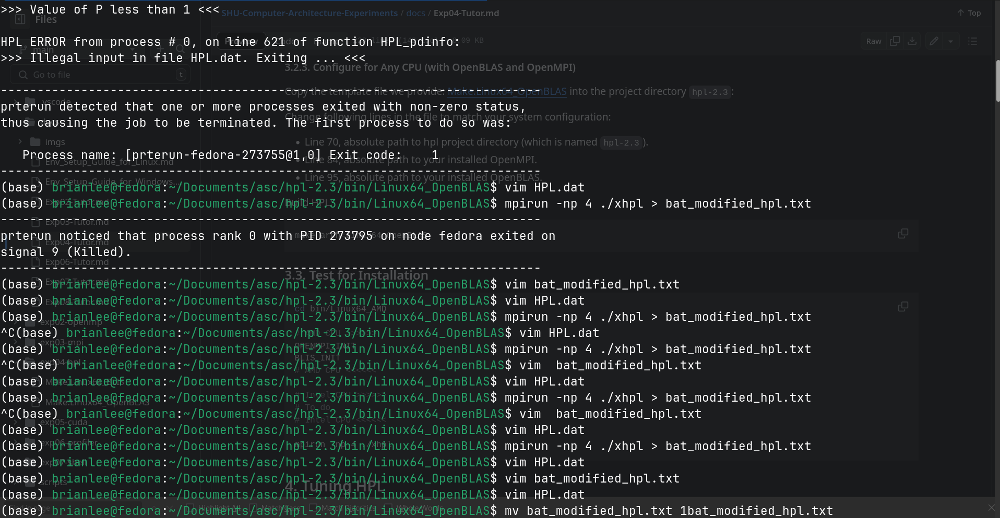

# Outcomes
* The best parameter

    |Key|Value|
    |---|---|
    |N|1000|
    |NB|64|
    |P|2|
    |Q|2|

    > More to see in `./exp4_result/HPL.bat`

* The best outcome: 4.7092e+01 GFlops
    > More to see in `./exp4_result/bat_modified_hpl.txt`

# Device
```shell
Architecture:             x86_64
  CPU op-mode(s):         32-bit, 64-bit
  Address sizes:          39 bits physical, 48 bits virtual
  Byte Order:             Little Endian
CPU(s):                   12
  On-line CPU(s) list:    0-11
Vendor ID:                GenuineIntel
  Model name:             12th Gen Intel(R) Core(TM) i7-1255U
    CPU family:           6
    Model:                154
    Thread(s) per core:   2
    Core(s) per socket:   10
    Socket(s):            1
    Stepping:             4
    CPU(s) scaling MHz:   64%
    CPU max MHz:          4700.0000
    CPU min MHz:          400.0000
    BogoMIPS:             5222.40
```

## Boring Shell screenshot


# Tips
1. Remember to `git stash` to restore the modification
2. When using submodule, `git submodule init` and `git submodule update` to download the code from the submodule.
3. NEVER `checkout` before you `add`, even without warning!